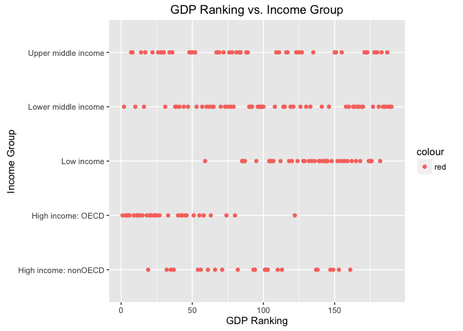

# CaseStudyConclusion
Mariana Llamas-Cendon  
10/26/2016  


##### Introduction:
###### This Case Study is focused on cleaning data from two raw data sets, one containing the World Bank Group rankings for the Gross Domestic Product of 190 countries and another (also from World Bank Group) related to Education Statistics (from which, the classification from income group will be considered for analysis).


#### How many IDs match from the merged data frame?

```r
geData <- merge(GdpData, EducData, by = "CountryCode", all =FALSE) 
```


```r
###### Check rows of geData after blanks from GDP.Ranking were eliminated 

nrow(geData)
```

```
## [1] 189
```


#### Sort the data frame in ascending order by GDP (so United States is last). What is the 13th country in the resulting data frame?

```r
## Create data frame ge.sorted to sort variable Gdp.Ranking in descending 
## order so USA is last.

ge.sorted <- geData[order(-geData$GDP.Ranking),] 

ge.sorted[1:189,1:2]
```

```
##     CountryCode GDP.Ranking
## 204         TUV         190
## 105         KIR         189
## 132         MHL         188
## 161         PLW         187
## 185         STP         186
## 68          FSM         185
## 200         TON         184
## 51          DMA         183
## 42          COM         182
## 219         WSM         181
## 212         VCT         180
## 78          GRD         178
## 106         KNA         178
## 216         VUT         177
## 75          GNB         176
## 74          GMB         175
## 178         SLB         174
## 191         SYC         173
## 10          ATG         172
## 115         LCA         171
## 199         TMP         170
## 24          BLZ         169
## 113         LBR         168
## 30          BTN         167
## 43          CPV         166
## 32          CAF         165
## 130         MDV         164
## 121         LSO         163
## 14          BDI         162
## 1           ABW         161
## 82          GUY         160
## 60          ERI         159
## 190         SWZ         158
## 179         SLE         157
## 195         TGO         156
## 65          FJI         155
## 143         MRT         154
## 28          BRB         153
## 145         MWI         152
## 139         MNE         151
## 186         SUR         150
## 25          BMU         149
## 73          GIN         148
## 127         MCO         147
## 108         KSV         146
## 103         KGZ         145
## 149         NER         144
## 197         TJK         143
## 172         RWA         142
## 128         MDA         141
## 16          BEN         140
## 87          HTI         139
## 21          BHS         138
## 136         MLT         137
## 111         LAO         136
## 134         MKD         135
## 224         ZWE         134
## 8           ARM         133
## 129         MDG         132
## 140         MNG         130
## 135         MLI         129
## 17          BFA         128
## 144         MUS         127
## 151         NIC         126
## 5           ALB         125
## 194         TCD         124
## 147         NAM         123
## 95          ISL         122
## 40          COG         121
## 104         KHM         120
## 176         SEN         119
## 142         MOZ         118
## 31          BWA         117
## 98          JAM         116
## 162         PNG         115
## 71          GEO         114
## 29          BRN         113
## 222         ZAR         112
## 22          BIH         111
## 76          GNQ         110
## 69          GAB         109
## 85          HND         108
## 154         NPL         107
## 206         UGA         106
## 3           AFG         105
## 223         ZMB         104
## 62          EST         103
## 47          CYP         102
## 201         TTO         101
## 180         SLV         100
## 38          CIV          99
## 39          CMR          98
## 167         PRY          97
## 26          BOL          96
## 205         TZA          95
## 124         LVA          94
## 20          BHR          93
## 99          JOR          92
## 198         TKM          91
## 220         YEM          90
## 158         PAN          89
## 183         SRB          88
## 102         KEN          87
## 72          GHA          86
## 63          ETH          85
## 122         LTU          84
## 112         LBN          83
## 125         MAC          82
## 44          CRI          81
## 188         SVN          80
## 202         TUN          79
## 209         URY          78
## 80          GTM          77
## 19          BGR          76
## 211         UZB          75
## 123         LUX          74
## 175         SDN          73
## 53          DOM          72
## 86          HRV          71
## 118         LKA          70
## 23          BLR          69
## 13          AZE          68
## 45          CUB          67
## 156         OMN          66
## 192         SYR          65
## 57          ECU          64
## 187         SVK          63
## 126         MAR          62
## 164         PRI          61
## 4           AGO          60
## 18          BGD          59
## 88          HUN          58
## 215         VNM          57
## 109         KWT          56
## 155         NZL          55
## 169         QAT          54
## 207         UKR          53
## 170         ROM          52
## 48          CZE          51
## 101         KAZ          50
## 159         PER          49
## 54          DZA          48
## 94          IRQ          47
## 92          IRL          46
## 166         PRT          45
## 157         PAK          44
## 64          FIN          43
## 77          GRC          42
## 160         PHL          41
## 96          ISR          40
## 150         NGA          39
## 58          EGY          38
## 84          HKG          37
## 36          CHL          36
## 177         SGP          35
## 146         MYS          34
## 52          DNK          33
## 6           ARE          32
## 196         THA          31
## 41          COL          30
## 213         VEN          29
## 221         ZAF          28
## 12          AUT          27
## 7           ARG          26
## 15          BEL          25
## 163         POL          24
## 153         NOR          23
## 93          IRN          22
## 189         SWE          21
## 34          CHE          20
## 174         SAU          19
## 152         NLD          18
## 203         TUR          17
## 89          IDN          16
## 107         KOR          15
## 131         MEX          14
## 61          ESP          13
## 11          AUS          12
## 33          CAN          11
## 91          IND          10
## 97          ITA           9
## 171         RUS           8
## 27          BRA           7
## 70          GBR           6
## 66          FRA           5
## 49          DEU           4
## 100         JPN           3
## 37          CHN           2
## 210         USA           1
```

```r
## To find the country located in the 13th place after the sorting,
## use column 4, the one that contains countries full names.

ge.sorted[13,11]
```

```
## [1] "St. Kitts and Nevis"
```

```r
## Coerce Income.Group from numeric to factor

ge.sorted$Income.Group <- as.factor(ge.sorted$Income.Group)

## Eliminate unused columns

ge.cleaned <- ge.sorted[,-c(3:10, 13:40)]
```

#### What are the average GDP rankings for the "High income: OECD" and "High income: nonOECD" groups?

```r
## Calculate the mean of GDP.Rankings for Income.group: 
## High income: OECD" and "High income: nonOECD"

mean(ge.sorted$GDP.Ranking[ge.sorted$Income.Group=="High income: OECD" ])
```

```
## [1] 32.96667
```

```r
mean(ge.sorted$GDP.Ranking[ge.sorted$Income.Group=="High income: nonOECD"])
```

```
## [1] 91.91304
```

#### Plot the GDP for all of the countries

```r
## Plot the GDP.Ranking for all of the countries by Income.Group

qplot(ge.sorted$GDP.Ranking, ge.sorted$Income.Group, main = "GDP Ranking vs. Income Group", xlab = "GDP Ranking", ylab = "Income Group", color = "red")
```

<!-- -->


##### From the plot it is evident that (from top to bottom):
###### Upper middle income has a high concentration of countries and a larger spread in relation to the GDP Ranking, from about 10 to almost 200.
###### Lower middle income has an even higher concentration of countries, and an even wider spread than that of the Upper middle income in relation to the GDP Ranking that extends from 0 to almost 200.
###### Low income is negatively skewed, spreading from about 60 to a little over 150. Nevertheless, the greater concentration is located between 125 to 175 but the concentration of countries is evidently lesser than the two previous ones.
###### High income: OECD, on the other hand, is positively skewed with the greater conentration between 0 to 25, and what could be considered an extreme outlier at approximately 125. 
###### High income: nonOECD shows what appears to be a leser number of countries spread from less than 25 to about 163. 
###### In summary, Upper and Lower middle incomes have a higher contration of countries and a wider spread across GDP Ranking.
###### Low income countries position themselves on the higher rankings of the GDP. 
###### Those from High income: OECD display a smaller concentration of countries and a narrower spread on the smaller rankings of GDP. 
###### High income: nonOECD, also shows a smaller concentration of countries, but it has a wider spread compared to that of the High income: OECD.


#### How many countries are Lower middle income but among the 38 nations with highest GDP?

```r
## Cut GDP.Ranking into 5 separate quantile groups. 

ge.sorted$Rank.Countries <- cut2(ge.sorted$GDP.Ranking, g=5)

# Make a table versus Income.Group.

table(ge.sorted$Rank.Countries, ge.sorted$Income.Group)
```

```
##            
##             High income: nonOECD High income: OECD Low income
##   [  1, 39)                    4                18          0
##   [ 39, 77)                    5                10          1
##   [ 77,115)                    8                 1          9
##   [115,154)                    5                 1         16
##   [154,190]                    1                 0         11
##            
##             Lower middle income Upper middle income
##   [  1, 39)                   5                  11
##   [ 39, 77)                  13                   9
##   [ 77,115)                  12                   8
##   [115,154)                   8                   8
##   [154,190]                  16                   9
```

###### 16 countries with Lower middle income are among the 38 with the highest GDP Rankings. One can assume that even though they are located on the Lower middle income the economy of their countries is not the healthiest.

##### Conclusion: 
###### It would be a general idea to think that the countries with the highest GDP rankings should be those with the lower incomes, and even though there is a higher concentration of countries with low income and high GDP ranking, there are others whether with upper middle income or lower middle income that also have a higher GDP ranking, which maybe due to the overall level of health of their economies. Although, those countries with high income that are members of the OECD have a lower GDP ranking than those who do not belong to the organization. Without further research, it would be speculative to assert that those countries members of the OECD have healthier economies that those who do not belong. 


